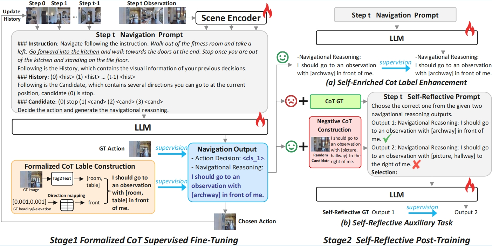

# EvolveNav: Self-Improving Embodied Reasoning for LLM-Based Vision-Language Navigation


<div align="center">
<a target="_blank" href="https://expectorlin.github.io/">Bingqian Lin</a><sup>1*</sup>,
<a href="https://scholar.google.com/citations?user=jV19-sIAAAAJ" target="_blank">Yunshuang Nie</a><sup>2*</sup>,
<a href="https://openreview.net/profile?id=~Khun_Loun_Zai2" target="_blank">Khun Loun Zai</a><sup>2</sup>,
<a target="_blank" href="http://sadil13.github.io/">Ziming Wei</a><sup>2</sup>,
<a target="_blank" href="https://mingfei.info/">Mingfei Han</a><sup>3</sup>,
<a target="_blank" href="https://rongtao-xu.github.io/">Rongtao Xu</a><sup>3</sup>,
<a href="https://openreview.net/profile?id=~Minzhe_Niu1" target="_blank">Minzhe Niu</a><sup>4</sup>,
<a href="https://scholar.google.com/citations?user=OEPMQEMAAAAJ&hl=en" target="_blank">Jianhua Han</a><sup>4</sup>,
<a target="_blank" href="http://www.linliang.net/">Liang Lin</a><sup>2</sup>,
<a target="_blank" href="https://www.mvig.org/">Cewu Lu</a><sup>1&ddagger;</sup>,
<a target="_blank" href="https://scholar.google.com/citations?user=voxznZAAAAAJ">Xiaodan Liang</a><sup>2&ddagger;</sup>

<sup>1</sup>Shanghai Jiao Tong University</span>
<sup>2</sup>Sun Yat-Sen University</span>
<sup>3</sup>Mohamed bin Zayed University of Artificial Intelligence</span>
<sup>4</sup>Huawei Noah’s Ark Lab</span>
<br/>
<sup>*</sup>Equal contribution.
<sup>&ddagger;</sup> Corresponding author.
</br>
</div>

<div align="center">
    <a href="https://arxiv.org/abs/2506.01551" target="_blank">
    </a>
</div>

Building Vision-Language Navigation (VLN) agents which can navigate following natural language instructions is a long-standing goal in human-robot interaction applications. Recent studies have revealed the potential of training open-source Large Language Models (LLMs) to unleash LLMs' reasoning ability for improving navigation, and simultaneously mitigate the domain gap between LLMs' training corpus and the VLN task. However, these approaches primarily adopt direct input-output mapping paradigms, causing the mapping learning difficult and the navigational decisions unexplainable. Chain-of-Thought (CoT) training is a promising way to improve both navigational decision accuracy and interpretability, while the complexity of the navigation task makes the perfect CoT labels unavailable and may lead to overfitting through pure CoT supervised fine-tuning. In this paper, we propose a novel sElf-improving embodied reasoning framework for boosting LLM-based vision-language Navigation, dubbed EvolveNav. Our EvolveNav consists of two stages: (1) Formalized CoT Supervised Fine-Tuning, where we train the model with formalized CoT labels to both activate the model's navigational reasoning capabilities and increase the reasoning speed; (2) Self-Reflective Post-Training, where the model is iteratively trained with its own reasoning outputs as self-enriched CoT labels to enhance the supervision diversity. A self-reflective auxiliary task is also introduced to encourage learning correct reasoning patterns by contrasting with wrong ones. Experimental results on the popular VLN benchmarks demonstrate the superiority of EvolveNav over previous LLM-based VLN approaches.




## :new: Updates
- [06/2025] [Arxiv paper](https://arxiv.org/abs/2506.01551) released.

## Installation

The environment installation of EvolveNav follows that in [NaviLLM](https://github.com/zd11024/NaviLLM).

1. Follow instructions [here](https://github.com/peteanderson80/Matterport3DSimulator) to install Matterport3D simulators.

2. Installation requirements for VLN training:
```setup
cd EvolveNav
conda create --name evolvenav python=3.8.16
conda activate evolvenav
pip install -r requirements.txt
```

## Data Preparation
### 1. navigation data, features, and model
   
Follow [NaviLLM](https://github.com/zd11024/NaviLLM) to get the navigation data, features, and model.

### 2. landmark data
   
Download the landmark data here.

## Training & Inference
### 1. Training

(1) Stage 1: Formalized CoT Supervised-Finetuning

In Stage 1 training, the maximum epoch number is set as 30 with 2000 steps per epoch. The model is trained on 8 NVIDIA A100 GPUs with ~75G memories. The training batch size is set as 1 on each GPU.
```setup
sh scripts/r2r_stage_1_training.sh
```

(2) Stage2: Self-Reflective Post-Training

In Stage 2 training, the maximum epoch number is set as 30 with 300 steps per epoch. The model is trained using the LoRA setting on 4 NVIDIA A100 GPUs with ~30G memories. The training batch size is set as 1 on each GPU.
```setup
sh scripts/r2r_stage_2_training.sh
```
### 2. Inference
The model can be tested on 4 NVIDIA A100 or V100 GPUs with ~24G memories. The testing batch size is set as 2 on each GPU.
```setup
sh scripts/evaluation/eval_r2r.sh
```

## Acknowledgement
Some of the codes are built upon [NaviLLM](https://github.com/zd11024/NaviLLM), [VLN-DUET](https://github.com/cshizhe/VLN-DUET), and [Tag2Text](https://github.com/xinyu1205/recognize-anything). Thanks for their great works!
